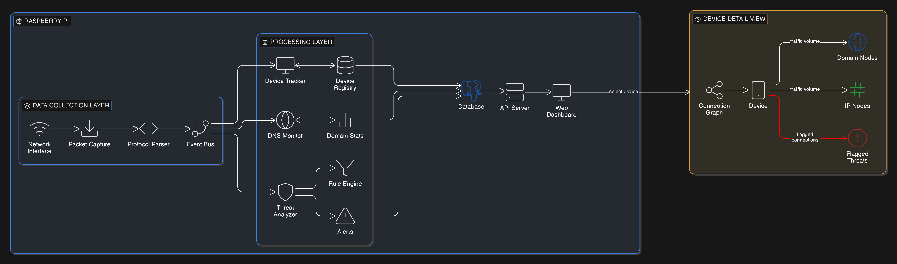

# NetWatch

A lightweight network monitor for Raspberry Pi. Tracks devices, logs DNS queries, detects threats.

## What It Does

- **Device Discovery** — Identifies devices by MAC, infers type from vendor + behavior
- **Traffic Analytics** — Tracks DNS queries and connection patterns per device
- **Threat Detection** — Flags port scans, suspicious destinations, anomalies
- **Connection Graph** — Visualize what each device talks to

## Architecture



## Requirements

- Raspberry Pi (3/4/5 or Zero 2)
- Rust 1.70+
- Linux with raw socket access

## Quick Start
```bash
# Build
cargo build --release

# Grant network capability (instead of running as root)
sudo setcap cap_net_raw=eip target/release/netwatch

# Run
./target/release/netwatch --interface eth0
```

## Deploy
```bash
./deploy.sh  # cross-compiles and pushes to Pi
```

## Status

Work in progress. Current: packet capture + device tracking.

## License

MIT

